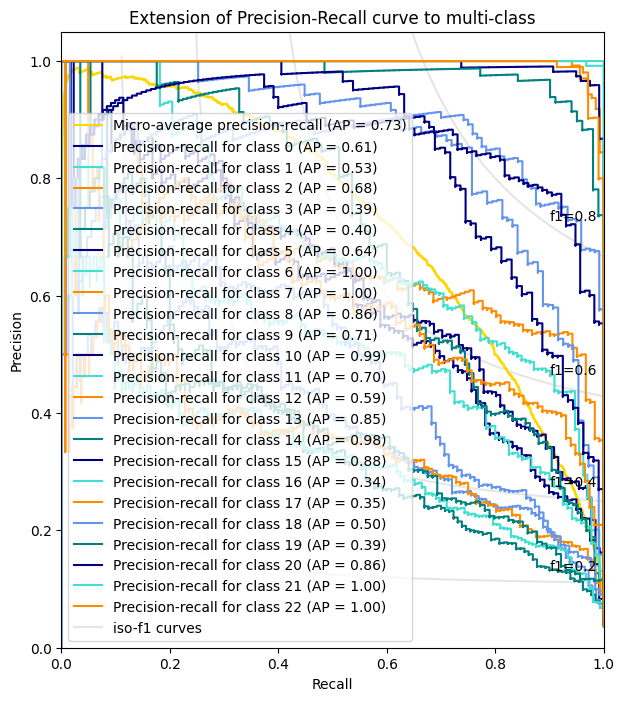
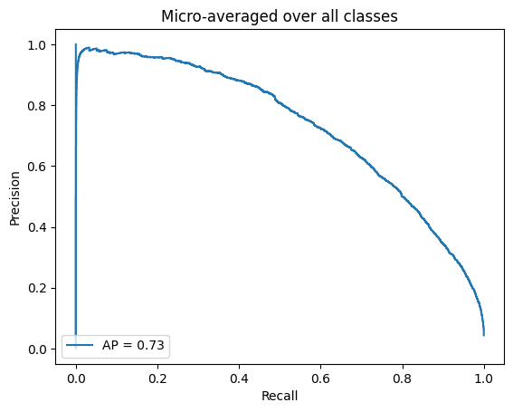
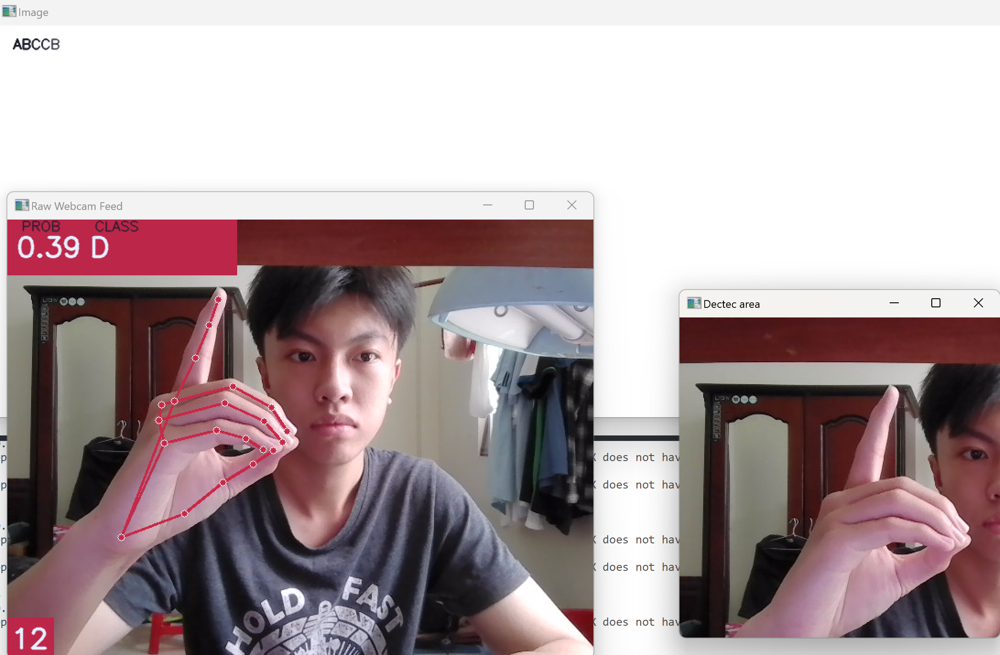

# [Hand Gesture Detection]

## Introduction
This project leverage the MediaPipe tool to collect a comprehensive dataset and develop a robust hand gesture recognition model designed to classify 23 alphabetic letters. The model utilizes the Random Forest algorithm, implemented through the sklearn library, to ensure high accuracy and efficiency in classification. In addition to the gesture recognition model, a handwriting input application is designed and implemented, allowing users to seamlessly translate hand gestures into written text, enhancing usability and accessibility.

## model_13-12 training result:

Overal, the final model is able to detect 23 letter, however, the matching probability is not consistent and stable, led to the difficulty  of application developing.

  
    
  Average precision vs recall for each class (left) and overal average precision vs recall (right).

  
  model_13-12 testing in hand gesture translating application.

## Guidance
Go to the Hand_model folder run the detection.py to examine the model, run the hand_sign_translate.py to test the hand gesture translating application.